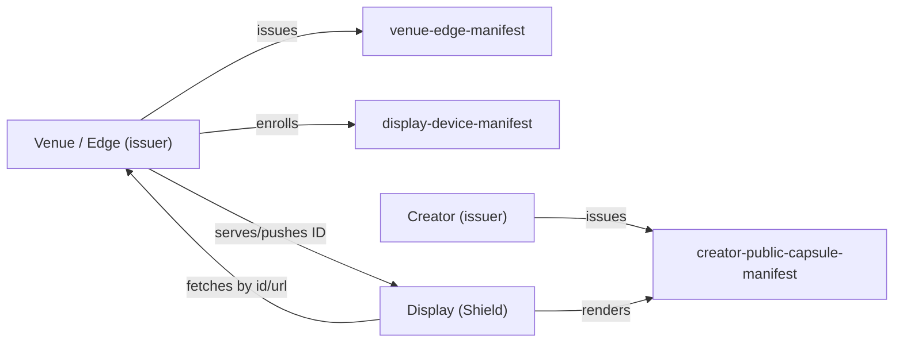

# Universal Manifest v0.1 — Stub Manifests (Near‑Real Fixtures)

This document is a **human-first index** of the Universal Manifest stub fixtures in `examples/v0.1/`, with:

- A short “why this exists” for each manifest
- Full JSON(-LD) inline (collapsed by default)
- Links to the **vision-driving** docs for each section (`subject`, `claims`, `consents`, `devices`, `pointers`, `facets`, `signature`, TTL)

> These stubs intentionally include **extra fields** not yet standardized in the v0.1 context/schema (v0.1 allows this). Treat them as *shape + intent* fixtures, not final ontology.

## Quick index (files)

Normative-ish minimal examples:

- `examples/v0.1/minimal-manifest.jsonld`
- `examples/v0.1/type-array-manifest.jsonld`
- `examples/v0.1/unknown-fields-manifest.jsonld`
- `examples/v0.1/manifest-with-facets.jsonld`

Richer “near-real” stubs:

- `examples/v0.1/stubs/venue-edge-manifest.jsonld`
- `examples/v0.1/stubs/display-device-manifest.jsonld`
- `examples/v0.1/stubs/creator-public-capsule-manifest.jsonld`
- `examples/v0.1/stubs/social-profile-manifest.jsonld`
- `examples/v0.1/stubs/display-envelope-manifest.jsonld`

Integration-lane stubs:

- `examples/v0.1/stubs/rp1-spatial-fabric-manifest.jsonld`
- `examples/v0.1/stubs/smart-glasses-consent-allowed-manifest.jsonld`
- `examples/v0.1/stubs/smart-glasses-consent-denied-manifest.jsonld`
- `examples/v0.1/stubs/metaverse-crossworld-profile-manifest.jsonld`
- `examples/v0.1/stubs/mastodon-personhood-multi-credential-manifest.jsonld`
- `examples/v0.1/stubs/bluesky-personhood-multi-credential-manifest.jsonld`
- `examples/v0.1/stubs/multi-did-method-coverage-manifest.jsonld`
- `examples/v0.1/stubs/did-vc-credential-lane-manifest.jsonld`

Integration-lane proof packs (under `examples/integrations/`, non-normative; see
`spec/v0.1/CONFORMANCE.md` §7.1 for how proof packs differ from the core conformance corpus):

Smart-glasses lane (WO-0216 batch 1):

- `examples/integrations/smart-glasses/baseline-public-venue-manifest.jsonld` — minimum-shape wearer manifest with default-deny recording consents and single public profile pointer.
- `examples/integrations/smart-glasses/near-real-context-aware-overlay-manifest.jsonld` — multi-context wearer with audience-scoped consents, professional credential, enrolled device, `arPolicyPack` priority rules.

Metaverse lane (WO-0216 batch 1):

- `examples/integrations/metaverse/baseline-portaling-manifest.jsonld` — minimum-shape visitor portaling envelope (profile + avatar pointers, default-deny social/voice).
- `examples/integrations/metaverse/near-real-portal-handshake-with-loading-content-manifest.jsonld` — verified-builder cross-world portaling envelope with portal-loading pointers, preload consent, compliance-share consent, and preference bundle.

Social lane (WO-0216 batch 1):

- `examples/integrations/social/baseline-public-profile-manifest.jsonld` — minimum-shape public profile with ActivityPub + Matrix pointers, default-deny indexing.
- `examples/integrations/social/near-real-multi-surface-profile-manifest.jsonld` — multi-surface creator profile (Pod canonical, ActivityPub, atproto, Matrix, website) with audience-scoped indexing consent.

Portable-identity-profile-xr lane (WO-0216 batch 2):

- `examples/integrations/portable-identity-profile-xr/baseline-conversational-ar-session-manifest.jsonld` — Scenario A baseline: pairwise subject conversational AR session with default-deny voice/recording, language-preference `portableProfile` facet, scenario-tagged `policyProfile` facet.
- `examples/integrations/portable-identity-profile-xr/near-real-immersive-retail-session-manifest.jsonld` — Scenarios B+C: immersive retail commerce + cross-world portability with audience-scoped commerce consent, age-over-18 claim, avatar/wearables/translation/proof-bundle/revocation pointers, multi-world `capabilityProfile`, freshness+revocation requirements, per-world pairwise strategy.

Runtime-profile lane (WO-0216 batch 2):

- `examples/integrations/runtime-profile/baseline-edge-issued-display-envelope-manifest.jsonld` — minimum-shape edge-issued display envelope: `edgeBaseUrl` + `edgeDescriptor` + `universalManifest.current` pointers, ID-only `telemetry.proofOfPlay` consent, single enrolled display device.
- `examples/integrations/runtime-profile/near-real-edge-discovery-with-bridge-adapter-manifest.jsonld` — full reference-runtime endpoint contract (`current`, `by-id`, `issue`, `resolve`, `ids`, `logs`), discovery descriptor with mDNS hint and fallback base URL, role-based federation taxonomy facet, push-signal-then-pull `transportProfile`, `freshnessPolicy` with `fail-closed-on-trust-sensitive`, v0.1-vs-v0.2 `signaturePolicy`, audience-scoped bridge-adapter consent, `authoritativeSource` + `changeLog` pointers.

DID + VC lane (WO-0216 batch 3):

- `examples/integrations/did-vc/baseline-did-web-vc-attestation-manifest.jsonld` — Tier 0 attestation-by-reference: `did:web` subject, default-deny `didvc.credentialShare`, status-list pointer, `didMethodProfile` + `vcAttestationProfile` facets.
- `examples/integrations/did-vc/near-real-multi-method-vp-claimproof-manifest.jsonld` — Tier 1 VP-claimProof: URI-reference + embedded-VP `claimProof` patterns, three-method DID profile (`did:web` subject + `did:key` recovery + `did:pkh` wallet-link), `identity.crossDidBinding` claim, audience-of-one consent, `trustPolicy` facet with `audienceBindingRequired` and `presentationReusePolicy: audience-of-one`.

Proof-of-personhood lane (WO-0216 batch 3):

- `examples/integrations/proof-of-personhood/baseline-single-provider-worldid-manifest.jsonld` — single-provider baseline: `did:key:` subject, one World ID Orb-level binary attestation with per-claim expiry independent of manifest TTL, default-deny `personhood.crossPlatformLink`.
- `examples/integrations/proof-of-personhood/near-real-multi-provider-aggregate-manifest.jsonld` — multi-provider aggregate: World ID + Gitcoin Passport + BrightID claims under distinct namespaces with per-claim VP `claimProof`, `identity.crossDidBinding` to a personhood-nullifier DID, audience-scoped cross-platform-link + provider-disclosure consent, `thresholdPolicy` (consumer-computed), `providerNamespaces` collision policy, `expirationPolicy` (`ignore-do-not-treat-as-current`).

Healthcare-patient-consent lane (WO-0216 batch 4):

- `examples/integrations/healthcare-patient-consent/baseline-emergency-allergy-share-manifest.jsonld` — baseline emergency/allergy share: `did:key:` patient subject, `health.shareEmergencyInfo` + `health.shareAllergies` allowed, `health.shareRecords` denied, `allergyAlerts` + `emergencyContact` + `patientConsent` facets, all three suggested pointer names, insurer-attested coverage claim with per-claim expiry independent of manifest TTL.
- `examples/integrations/healthcare-patient-consent/near-real-emergency-department-handoff-manifest.jsonld` — pairwise `did:web:` subject, audience-scoped `health.shareRecords: restricted` per the firewall-model rule pattern (audience + contexts: emergency/clinical + ruleId + scope.facets/fields + priority), `identity.crossDidBinding` from wallet DID to legacy EHR MRN, insurer-attested coverage with VP `claimProof` reference, clinical-grade RxNorm-coded allergy alerts, `freshnessPolicy` (`fail-closed` on stale consent), `auditPolicy` facet (id-only retention; HIPAA + GDPR-health basis).

Education-credentials lane (WO-0216 batch 4):

- `examples/integrations/education-credentials/baseline-degree-skill-attestation-manifest.jsonld` — baseline graduate manifest: `did:key:` subject, three issuer-attested claims (`edu.degreeStatus: conferred`, `edu.enrollmentStatus: graduated`, `edu.certificationValid: valid`) with per-claim expiry on the certification, `edu.verifyDegree` + `edu.shareSkills` allowed and `edu.shareTranscript` denied, `academicCredential` + `skillAttestation` + `credentialPolicy` facets, all three suggested pointer names.
- `examples/integrations/education-credentials/near-real-employer-verification-with-claimproof-manifest.jsonld` — `did:web:wallet.example` subject, four issuer-attested claims with `claimProof` (URI reference for registrar claims; embedded VP for the certification — exercises both lane patterns), audience-of-one `edu.verifyDegree` + `edu.shareSkills` for a named hiring organization in `hiring` context, `identity.crossDidBinding` to the registrar's student-record DID, `credentialPolicy` with `audienceBindingRequired` + `claimProofPolicy.issuerBindingRequired: true` + `expirationPolicy.expiredClaimsTreatment: ignore-do-not-treat-as-current`.

Smart-home lane (WO-0216 batch 4):

- `examples/integrations/smart-home/baseline-household-policy-manifest.jsonld` — baseline household policy: `did:key:` household subject, all three lane consents default-denied (`home.shareUsageData`, `home.allowRemoteAccess`, `home.shareLocation`), `homePolicy` facet (`default-private`, `dataRetention: local-only`, `telemetryPolicy: none`), single `deviceIdentity` facet, all three suggested pointer names.
- `examples/integrations/smart-home/near-real-multi-device-onboarding-manifest.jsonld` — `did:web:home.rivera.example` subject, three enrolled devices in the top-level `devices` array plus matching `deviceIdentity` facets, audience-scoped `home.shareUsageData: restricted` for a named energy provider in `demand-response` context, audience-scoped `home.allowRemoteAccess: restricted` for the owner's named cloud relay, location stays default-deny, `automationRules` facet, `policyEnforcementProfile` with `freshnessPolicy.staleManifestTreatment: fail-closed` + `remoteAccessPolicy.rejectAnyOtherOrigin: true` + `telemetryPolicy.locationStripping: always`.

Data-firewall-ux lane (WO-0216 batch 5):

- `examples/integrations/data-firewall-ux/baseline-default-deny-rule-set-manifest.jsonld` — baseline default-deny rule set: `did:key:` subject, three default-deny consents (`data.shareProfile`, `data.shareTelemetry`, `data.shareLocation`) each with a `ruleId`, self-asserted `firewall.policy.defaultEffect: deny` claim, `firewallPolicy` facet (`tieBreaker: deny-wins`, `rulePrecedence: specific-over-broad`, `logging.keyedBy: manifestId`, `fullPayloadRetention: never`), `ruleSet` facet enumerating the three baseline rules, three suggested pointer names (rule editor, decision panel, audit log).
- `examples/integrations/data-firewall-ux/near-real-audience-scoped-rule-overrides-manifest.jsonld` — pairwise `did:web:` subject, two `data.shareProfile` rules at differing priorities (high-priority audience-scoped restricted for the named clinic in `emergency`/`clinical` contexts at `priority: 90` + low-priority deny fallback at `priority: 10`) demonstrating "specific-over-broad, deny-wins-ties", audience-scoped `data.shareTelemetry: restricted` with per-rule `expiresAt` independent of manifest TTL, `firewall.ruleSet.version` claim correlating decisions to a frozen rule snapshot, `firewallPolicy` + `decisionPanelDescriptor` (renderer contract for matched rule id, factors, reason text) + `auditViewDescriptor` (id-keyed-only retention contract) facets.

OMA-Trust lane (WO-0216 batch 5; complements the three WO-0027 stubs under `examples/v0.1/stubs/`):

- `examples/integrations/oma-trust/baseline-self-attesting-service-manifest.jsonld` — baseline self-attesting service tier: `did:web:` subject is also the issuer, `omatrust.policy.trustMode: self-attested`, all attestation claims `self-asserted`, `omatrust.attestation.securityAssessment.status: not-assessed`, `omatrust.shareReputation: allowed` + `omatrust.shareProofMeta: denied` (no proof metadata to surface), all four suggested pointer names, `omaTrustReputation` + `omaTrustLifecycle` facets. Documents the lowest trust tier explicitly so consumers know to evaluate additional out-of-band signals before promoting.
- `examples/integrations/oma-trust/near-real-multi-attester-aggregate-manifest.jsonld` — multi-attester aggregate: `omatrust.policy.trustMode: trusted-attester-aggregate`, two distinct trusted-attester endorsement claims (operational + security) with per-claim expiry, SOC2 Type-2 certification, security-assessment claim with embedded VP `claimProof` matching the issuer DID, audience-scoped `omatrust.shareProofMeta: restricted` for a named relying party in `high-trust-evaluation` context, `omaTrustReputation` with `attesters[]` + consumer-computed `thresholdPolicy` (`minEndorsements: 2`, `minDistinctAttesterDomains: 2`), `omaTrustLifecycle` with `freshnessPolicy.staleEvidenceTreatment: fail-closed`, `trustEvaluationProfile` codifying consumer evaluation order.

RP1 spatial-fabric lane (WO-0216 batch 5; complements the three stubs under `examples/v0.1/stubs/`):

- `examples/integrations/rp1-spatial-fabric/baseline-single-fabric-anchor-set-manifest.jsonld` — baseline visitor tier: `did:key:` visitor subject, all four lane consents at default settings (`spatial.locationShare` + `spatial.crossWorldLinking` + `spatial.sessionReplay` denied; `spatial.anchorShare` allowed for portable saved anchors), four of the six suggested pointer names (no `rp1.attachmentIndex` / `rp1.sessionContext` because the baseline tier has no child-scope mounts and no live session), single saved-entry anchor in `spatialAnchors`, single place membership, baseline `spatialAssetProfile` (`maxEmbeddedBytes: 0`).
- `examples/integrations/rp1-spatial-fabric/near-real-multi-fabric-cross-world-attachment-manifest.jsonld` — multi-fabric cross-world tour: pairwise `did:web:` subject, trust-broker-issued `spatial.crossWorldEligibility` claim with per-claim expiry, `identity.crossDidBinding` to a `did:pkh` chain wallet (creator recognition across fabrics), audience-scoped `spatial.locationShare: restricted` for a named wayfinding service in `wayfinding` context (place-membership only — no anchor coordinates), audience-scoped `spatial.crossWorldLinking: restricted` for one named child fabric scope under `creator-tour` context with field-level scope selector, full six-pointer set with `observedAt` + tight `expiresAt` on `rp1.attachmentIndex` (15 min) and `rp1.sessionContext` (6 min), multi-anchor `spatialAnchors` (portal + tour-stop), `spatialFabricAttachmentPolicy` with `cycleHandling: track-visited-scopes` + `repeatedMountPolicy: single-mount-per-traversal`, `crossWorldWayfinding` (`audienceBindingRequired: true`), `spatialEnforcementProfile` (`staleAttachmentTreatment: deny-child-scope-traversal` + `expiredSessionTreatment: deny-replay-and-reuse` + `assetEmbeddingPolicy.embeddingAllowed: false`).

## Vision drivers (by section)

Use these links to understand **why a section exists** and what direction it’s meant to support.

| Manifest section | What it’s for | Primary drivers |
|---|---|---|
| `@id` (Manifest ID) | Stable reference for caching + telemetry/logging | `docs/DECISIONS.md` (Manifest ID generation), `spec/v0.1/README.md` |
| `issuedAt` / `expiresAt` (TTL) | Prevent stale cache + bound trust window | `spec/v0.1/README.md` (ID + caching guidance), `integrations/reference-runtime.md`, `docs/CRUCIAL-DETAILS.md` |
| `subject` | Who the manifest is “about” (user/device/venue) | `docs/PROJECT-VISION.md`, `research/federation/universal-manifest-workstream.md` |
| `facets` | Composable sub-documents (embed or reference) | `spec/v0.1/README.md` (Facet), `examples/v0.1/manifest-with-facets.jsonld`, `research/reference-platform/profile-architecture.md` |
| `claims` | Roles/permissions/verification/policy assertions | `docs/PROJECT-VISION.md`, `research/federation/universal-manifest-workstream.md` |
| `consents` | Privacy + surface permissions (public display, analytics) | `docs/PROJECT-VISION.md`, `research/federation/universal-manifest-workstream.md` |
| `devices` | Device registrations + trust levels | `integrations/reference-runtime.md`, `research/reference-platform/operational-runbooks.md` |
| `pointers` | Canonical sources + interoperability links (Pod/Matrix/etc.) | `docs/PROJECT-VISION.md`, `research/reference-platform/interoperability-sync.md`, `research/reference-platform/appendices-and-standards-mapping.md` |
| `signature` | Signature (format intentionally permissive in v0.1) | `docs/DECISIONS.md` (security scope), `spec/v0.1/README.md`, `research/reference-platform/appendices-and-standards-mapping.md` |

## How these fixtures connect (conceptual)

At a high level, these fixtures are meant to represent the **minimum useful “state capsule”** reference implementation surfaces can move around:



- The **venue** defines policy + its edge node identity and can enroll trusted devices.
- The **display** is a constrained consumer: it caches manifests briefly and logs by `@id`.
- The **creator** provides a “public capsule” projection that is safe for public screens.

## Stub manifests (full JSON-LD)

### `minimal-manifest.jsonld` (baseline)

Purpose:

- Bare-minimum valid `um:Manifest` shape.
- Useful as a schema/assertion sanity check.

Driver docs:

- `spec/v0.1/README.md`

<details>
<summary>Show JSON</summary>

```json
{
  "@context": "../../spec/v0.1/schema.jsonld",
  "@id": "urn:uuid:2b5f0d3c-3c4c-4b83-8f2a-6f3b2cbd5c7d",
  "@type": "um:Manifest",
  "manifestVersion": "0.1",
  "subject": "did:key:z6MkpExampleSubjectDid",
  "issuedAt": "2026-02-11T20:45:58Z",
  "expiresAt": "2026-02-12T20:45:58Z",
  "facets": []
}
```

</details>

---

### `type-array-manifest.jsonld` (baseline: `@type` as an array)

Purpose:

- Demonstrates that `@type` may be a **string or array** (both are allowed in v0.1).

Driver docs:

- `spec/v0.1/README.md`
- `spec/v0.1/CONFORMANCE.md`

<details>
<summary>Show JSON</summary>

```json
{
  "@context": "../../spec/v0.1/schema.jsonld",
  "@id": "urn:uuid:974fac2e-6233-41b4-9f17-55fe75c4c346",
  "@type": ["um:Manifest", "um:Example"],
  "manifestVersion": "0.1",
  "subject": "did:key:z6MkpExampleSubjectDid",
  "issuedAt": "2026-02-12T02:00:00Z",
  "expiresAt": "2026-02-13T02:00:00Z",
  "facets": []
}
```

</details>

---

### `manifest-with-facets.jsonld` (baseline facet composition)

Purpose:

- Demonstrates `facets` as the primary “composition” mechanism.
- Shows a facet that is a pointer (`ref`) and a facet that embeds an entity.

Driver docs:

- `spec/v0.1/README.md` (Facet definition)
- `research/reference-platform/profile-architecture.md` (“canonical vs projected” state; capsule concept)

<details>
<summary>Show JSON</summary>

```json
{
  "@context": "../../spec/v0.1/schema.jsonld",
  "@id": "urn:uuid:9a1d6db7-0f2f-4f5a-b3b9-2c68c23f9c25",
  "@type": "um:Manifest",
  "manifestVersion": "0.1",
  "subject": "did:web:venue.localartist.network",
  "issuedAt": "2026-02-11T20:45:58Z",
  "expiresAt": "2026-02-12T20:45:58Z",
  "facets": [
    {
      "@type": "um:Facet",
      "name": "canonicalProfilePointer",
      "ref": "https://example.pod.provider/profile.jsonld",
      "entity": {
        "@id": "did:key:z6MkpExampleSubjectDid",
        "@type": "um:Entity",
        "name": "Example Creator"
      }
    },
    {
      "@type": "um:Facet",
      "name": "deviceRegistration",
      "entity": {
        "@id": "urn:uuid:36cf6d1c-e119-44b0-b0a6-5e1da0fbfe16",
        "@type": "um:Entity",
        "name": "NVIDIA Shield TV Pro",
        "description": "Public display device enrolled to a venue edge."
      }
    }
  ],
  "signature": {
    "algorithm": "Ed25519",
    "keyRef": "did:web:venue.localartist.network#keys-1",
    "value": "BASE64URL_SIGNATURE_PLACEHOLDER"
  }
}
```

</details>

---

### `venue-edge-manifest.jsonld` (near-real: venue identity + policy + edge node)

Purpose:

- Venue “anchor” document: who the venue is, the **policy envelope**, and the edge node’s reference implementation endpoints.
- Includes enrolled device metadata for the **NVIDIA Shield TV Pro** test hardware.

Driver docs:

- `integrations/reference-runtime.md` (roles; transport; device caching/logging)
- `research/reference-platform/operational-runbooks.md` (venue onboarding; device enrollment)
- `research/reference-platform/appendices-and-standards-mapping.md` (DID + Solid + Matrix + Ed25519 mapping)

<details>
<summary>Show JSON</summary>

```json
{
  "@context": "../../../spec/v0.1/schema.jsonld",
  "@id": "urn:uuid:dfbd3b8a-ec7c-40c4-a3e4-114ec972d41a",
  "@type": "um:Manifest",
  "manifestVersion": "0.1",
  "subject": "did:web:ember-cafe.localartist.network",
  "issuedAt": "2026-02-12T02:00:00Z",
  "expiresAt": "2026-02-13T02:00:00Z",
  "facets": [
    {
      "@type": "um:Facet",
      "name": "venueIdentity",
      "entity": {
        "@id": "did:web:ember-cafe.localartist.network",
        "@type": ["um:Entity", "um:Venue"],
        "name": "Ember Cafe (Demo Venue)",
        "description": "Example venue used for reference implementation + Universal Manifest v0.1 fixture data.",
        "timezone": "America/New_York",
        "locale": "en-US"
      }
    },
    {
      "@type": "um:Facet",
      "name": "venuePolicy",
      "entity": {
        "@id": "urn:uuid:a873eefb-4811-4bba-887d-dfa8c7cfe3ac",
        "@type": ["um:Entity", "um:VenuePolicy"],
        "safeMode": "PG-13",
        "contentRules": {
          "allowNudity": false,
          "allowHateSymbols": false,
          "allowGore": false,
          "maxAudioDb": 80
        },
        "curation": {
          "preferredMedia": ["image", "video"],
          "preferredTags": ["local", "photography", "painting", "illustration"],
          "avoidTags": ["political-ads"]
        }
      }
    },
    {
      "@type": "um:Facet",
      "name": "edgeNode",
      "entity": {
        "@id": "did:key:z6MkiEdgeNodeExampleDid",
        "@type": ["um:Entity", "um:EdgeNode"],
        "name": "Ember Edge Node",
        "edgeBaseUrl": "http://um-edge-ember.local:3002",
        "discovery": {
          "mdnsService": "_um-edge._tcp.local",
          "edgeDescriptorUrl": "http://um-edge-ember.local:3002/.well-known/um/edge.json"
        }
      }
    }
  ],
  "claims": [
    {
      "@type": "um:Claim",
      "name": "role",
      "value": "venue",
      "issuer": "did:web:ember-cafe.localartist.network"
    },
    {
      "@type": "um:Claim",
      "name": "policy.safeMode",
      "value": "PG-13",
      "issuer": "did:web:ember-cafe.localartist.network"
    }
  ],
  "devices": [
    {
      "deviceDid": "did:key:z6MkiShieldTvProExampleDid",
      "displayId": "shield-tv-pro-001",
      "trust": "enrolled",
      "hardware": {
        "model": "NVIDIA Shield TV Pro",
        "modelNumber": "945-12897-2500-101",
        "platform": "Android TV"
      },
      "enrolledAt": "2026-02-11T23:15:00Z"
    }
  ],
  "pointers": [
    {
      "name": "edgeDescriptor",
      "url": "http://um-edge-ember.local:3002/.well-known/um/edge.json"
    },
    {
      "name": "matrixRoom.updates",
      "url": "https://matrix.to/#/#um-updates:localartist.network"
    },
    {
      "name": "matrixRoom.revocations",
      "url": "https://matrix.to/#/#um-global-revocations:localartist.network"
    },
    {
      "name": "solidPod.venueCanonical",
      "url": "https://pods.localartist.network/venues/ember-cafe/"
    }
  ],
  "signature": {
    "algorithm": "Ed25519",
    "keyRef": "did:web:ember-cafe.localartist.network#keys-1",
    "value": "BASE64URL_SIGNATURE_PLACEHOLDER"
  }
}
```

</details>

---

### `display-device-manifest.jsonld` (near-real: Shield enrollment + venue association)

Purpose:

- A device-scoped manifest for an enrolled display.
- Encodes: device capabilities, association to a venue DID, and operational pointers back to the edge.

Driver docs:

- `integrations/reference-runtime.md` (Shield caching/logging; update signaling)
- `research/reference-platform/operational-runbooks.md` (screen enrollment + credentials)
- `research/reference-platform/interoperability-sync.md` (push signal → fetch flow)

<details>
<summary>Show JSON</summary>

```json
{
  "@context": "../../../spec/v0.1/schema.jsonld",
  "@id": "urn:uuid:b95f0be3-70fa-405a-af25-543b89530fd1",
  "@type": "um:Manifest",
  "manifestVersion": "0.1",
  "subject": "did:key:z6MkiShieldTvProExampleDid",
  "issuedAt": "2026-02-12T02:00:00Z",
  "expiresAt": "2026-02-12T03:00:00Z",
  "facets": [
    {
      "@type": "um:Facet",
      "name": "deviceIdentity",
      "entity": {
        "@id": "did:key:z6MkiShieldTvProExampleDid",
        "@type": ["um:Entity", "um:DisplayDevice"],
        "name": "NVIDIA Shield TV Pro (Test Device)",
        "modelNumber": "945-12897-2500-101",
        "capabilities": {
          "rendering": ["webgl2"],
          "maxResolution": "3840x2160",
          "preferredRenderResolution": "1920x1080"
        }
      }
    },
    {
      "@type": "um:Facet",
      "name": "venueAssociation",
      "ref": "did:web:ember-cafe.localartist.network",
      "entity": {
        "@id": "did:web:ember-cafe.localartist.network",
        "@type": ["um:Entity", "um:Venue"],
        "name": "Ember Cafe (Demo Venue)"
      }
    }
  ],
  "claims": [
    {
      "@type": "um:Claim",
      "name": "role",
      "value": "display",
      "issuer": "did:web:ember-cafe.localartist.network"
    },
    {
      "@type": "um:Claim",
      "name": "policy.safeMode",
      "value": "PG-13",
      "issuer": "did:web:ember-cafe.localartist.network"
    }
  ],
  "consents": [
    {
      "@type": "um:Consent",
      "name": "telemetry.proofOfPlay",
      "value": "allowed",
      "notes": "Logs should store manifest @id references, not full content payloads."
    }
  ],
  "devices": [
    {
      "deviceDid": "did:key:z6MkiShieldTvProExampleDid",
      "displayId": "shield-tv-pro-001",
      "trust": "enrolled"
    },
    {
      "deviceDid": "did:key:z6MkiEdgeNodeExampleDid",
      "trust": "local"
    }
  ],
  "pointers": [
    {
      "name": "edgeBaseUrl",
      "url": "http://um-edge-ember.local:3002"
    },
    {
      "name": "edgeDescriptor",
      "url": "http://um-edge-ember.local:3002/.well-known/um/edge.json"
    },
    {
      "name": "universalManifest.current",
      "url": "http://um-edge-ember.local:3002/api/v1/universal-manifests/current?displayId=shield-tv-pro-001"
    },
    {
      "name": "consumerExperience",
      "url": "http://um-edge-ember.local:5175/"
    }
  ],
  "signature": {
    "algorithm": "Ed25519",
    "keyRef": "did:web:ember-cafe.localartist.network#keys-1",
    "value": "BASE64URL_SIGNATURE_PLACEHOLDER"
  }
}
```

</details>

---

### `creator-public-capsule-manifest.jsonld` (near-real: creator + public capsule projection)

Purpose:

- A creator-scoped manifest that carries (or points to) a **Public Capsule**: safe-to-render data for public screens.
- Demonstrates: canonical pointer facet + embedded public capsule facet.

Driver docs:

- `research/reference-platform/profile-architecture.md` (public capsule; canonical vs projected)
- `research/reference-platform/interoperability-sync.md` (capsule update signaling)
- `research/reference-platform/appendices-and-standards-mapping.md` (Solid/Matrix/ActivityPub mapping)

<details>
<summary>Show JSON</summary>

```json
{
  "@context": "../../../spec/v0.1/schema.jsonld",
  "@id": "urn:uuid:250acd0e-0709-4430-bc31-6b6bf41b72cb",
  "@type": "um:Manifest",
  "manifestVersion": "0.1",
  "subject": "did:key:z6MkiAliceRiveraExampleDid",
  "issuedAt": "2026-02-12T02:00:00Z",
  "expiresAt": "2026-02-13T02:00:00Z",
  "facets": [
    {
      "@type": "um:Facet",
      "name": "canonicalProfilePointer",
      "ref": "https://pods.localartist.network/creators/alice-rivera/profile.jsonld",
      "entity": {
        "@id": "did:key:z6MkiAliceRiveraExampleDid",
        "@type": ["um:Entity", "um:Creator"],
        "name": "Alice Rivera",
        "handle": "@alice",
        "homeCity": "Providence, RI"
      }
    },
    {
      "@type": "um:Facet",
      "name": "publicCapsule",
      "entity": {
        "@id": "urn:uuid:8ea146e2-743a-4f0b-8f99-a53be2d5b614",
        "@type": ["um:Entity", "um:PublicCapsule"],
        "profile": {
          "displayName": "Alice Rivera",
          "bio": "Street photography + mixed media collage exploring memory and neighborhood ritual.",
          "avatarUrl": "https://media.localartist.network/avatars/alice-rivera.jpg"
        },
        "featuredItems": [
          {
            "type": "CreativeWork",
            "title": "Corner Store Sunlight",
            "mediaUrl": "https://media.localartist.network/works/alice-rivera/corner-store-sunlight.jpg",
            "license": "CC-BY-NC"
          },
          {
            "type": "CreativeWork",
            "title": "Night Bus Polaroids",
            "mediaUrl": "https://media.localartist.network/works/alice-rivera/night-bus-polaroids.mp4",
            "license": "CC-BY-NC"
          }
        ],
        "safetyMode": "PG-13",
        "expiration": "2026-02-13T02:00:00Z"
      }
    }
  ],
  "claims": [
    {
      "@type": "um:Claim",
      "name": "role",
      "value": "creator",
      "issuer": "did:key:z6MkiAliceRiveraExampleDid"
    },
    {
      "@type": "um:Claim",
      "name": "verification.status",
      "value": "unverified",
      "issuer": "did:key:z6MkiAliceRiveraExampleDid"
    }
  ],
  "consents": [
    {
      "@type": "um:Consent",
      "name": "publicDisplay",
      "value": "allowed",
      "notes": "Allows venues to render the Public Capsule on screens."
    },
    {
      "@type": "um:Consent",
      "name": "analytics.proofOfPlay",
      "value": "allowed",
      "notes": "Allows venues to emit proof-of-play events keyed by manifestId."
    }
  ],
  "pointers": [
    {
      "name": "solidPod.creatorCanonical",
      "url": "https://pods.localartist.network/creators/alice-rivera/"
    },
    {
      "name": "matrix.userId",
      "url": "https://matrix.to/#/@alice:localartist.network"
    },
    {
      "name": "activityPub.actor",
      "url": "https://localartist.network/@alice"
    }
  ],
  "signature": {
    "algorithm": "Ed25519",
    "keyRef": "did:key:z6MkiAliceRiveraExampleDid#key-1",
    "value": "BASE64URL_SIGNATURE_PLACEHOLDER"
  }
}
```

</details>

---

### `social-profile-manifest.jsonld` (near-real: portable public profile for future social surfaces)

Purpose:

- A person/creator-scoped manifest that can drive a **public profile** in any compatible system (reference implementation web views, future social profile views, or other DC properties).
- Demonstrates how `facets` can embed a schema-aligned profile (`schema:Person`) while still pointing to canonical sources (Pod / ActivityPub).

Driver docs:

- `docs/PROJECT-VISION.md` (portable state capsule; pointers instead of big payloads)
- `research/reference-platform/interoperability-sync.md` (federated surfaces; update signaling)
- `research/reference-platform/appendices-and-standards-mapping.md` (Solid/Matrix/DID/crypto mapping)

<details>
<summary>Show JSON</summary>

```json
{
  "@context": "../../../spec/v0.1/schema.jsonld",
  "@id": "urn:uuid:9db256d6-e70d-4d07-806d-185f7972aa14",
  "@type": "um:Manifest",
  "manifestVersion": "0.1",
  "subject": "did:key:z6MkiJulesChenExampleDid",
  "issuedAt": "2026-02-12T02:00:00Z",
  "expiresAt": "2026-02-13T02:00:00Z",
  "facets": [
    {
      "@type": "um:Facet",
      "name": "canonicalProfilePointer",
      "ref": "https://pods.localartist.network/creators/jules-chen/profile.jsonld",
      "entity": {
        "@id": "did:key:z6MkiJulesChenExampleDid",
        "@type": ["um:Entity", "um:Creator"],
        "name": "Jules Chen",
        "handle": "@jules",
        "homeCity": "Boston, MA"
      }
    },
    {
      "@type": "um:Facet",
      "name": "publicProfile",
      "entity": {
        "@id": "https://localartist.network/@jules",
        "@type": ["um:Entity", "schema:Person", "um:PublicProfile"],
        "name": "Jules Chen",
        "description": "Generative visuals + ambient synth performances for small rooms and late-night galleries.",
        "schema:image": "https://media.localartist.network/avatars/jules-chen.jpg",
        "schema:sameAs": [
          "https://localartist.network/@jules",
          "https://matrix.to/#/@jules:localartist.network"
        ],
        "schema:knowsAbout": ["generative art", "synth", "projection mapping"]
      }
    }
  ],
  "claims": [
    {
      "@type": "um:Claim",
      "name": "role",
      "value": "creator",
      "issuer": "did:key:z6MkiJulesChenExampleDid"
    },
    {
      "@type": "um:Claim",
      "name": "verification.status",
      "value": "unverified",
      "issuer": "did:key:z6MkiJulesChenExampleDid"
    }
  ],
  "consents": [
    {
      "@type": "um:Consent",
      "name": "social.profilePublic",
      "value": "allowed",
      "notes": "Allows publishing a public profile view (web + ActivityPub) derived from this manifest."
    },
    {
      "@type": "um:Consent",
      "name": "publicDisplay",
      "value": "allowed",
      "notes": "Allows venues to render safe public profile fields on screens."
    }
  ],
  "pointers": [
    {
      "name": "solidPod.creatorCanonical",
      "url": "https://pods.localartist.network/creators/jules-chen/"
    },
    {
      "name": "activityPub.actor",
      "url": "https://localartist.network/@jules"
    },
    {
      "name": "matrix.userId",
      "url": "https://matrix.to/#/@jules:localartist.network"
    }
  ],
  "signature": {
    "algorithm": "Ed25519",
    "keyRef": "did:key:z6MkiJulesChenExampleDid#key-1",
    "value": "BASE64URL_SIGNATURE_PLACEHOLDER"
  }
}
```

</details>

---

### `display-envelope-manifest.jsonld` (near-real: minimal display-local capsule)

Purpose:

- Smallest “reference implementation-adjacent” fixture: a manifest about a display when you **don’t have DID** (yet).
- Intended to illustrate the spec non-goal: *must function without DID*.

Driver docs:

- `docs/PROJECT-VISION.md` (DID not required)
- `integrations/reference-runtime.md` (display role; minimal caching/logging)

<details>
<summary>Show JSON</summary>

```json
{
  "@context": "../../../spec/v0.1/schema.jsonld",
  "@id": "urn:uuid:045f1f58-bcab-40c5-936b-b84d4e55144a",
  "@type": "um:Manifest",
  "manifestVersion": "0.1",
  "subject": "urn:um:display:shield-tv-pro-001",
  "issuedAt": "2026-02-12T02:00:00Z",
  "expiresAt": "2026-02-12T03:00:00Z",
  "devices": [
    {
      "displayId": "shield-tv-pro-001",
      "trust": "local"
    }
  ]
}
```

</details>
