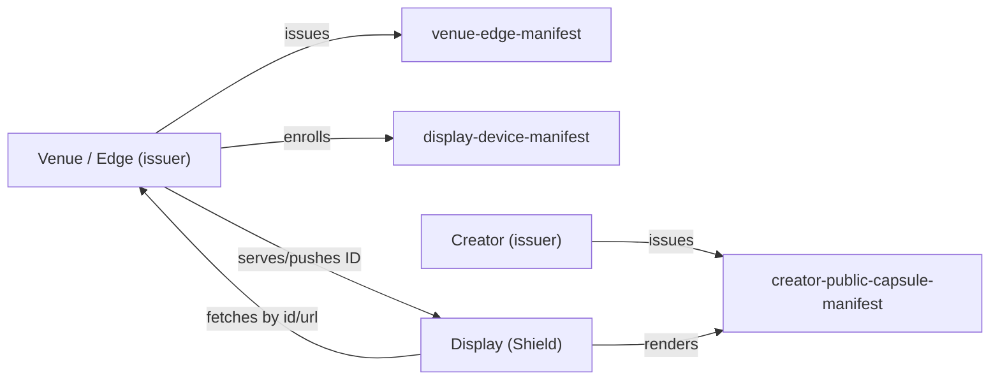

# Universal Manifest v0.1 — Stub Manifests (Near‑Real Fixtures)

This document is a **human-first index** of the Universal Manifest stub fixtures in `examples/v0.1/`, with:

- A short “why this exists” for each manifest
- Full JSON(-LD) inline (collapsed by default)
- Links to the **vision-driving** docs for each section (`subject`, `claims`, `consents`, `devices`, `pointers`, `shards`, `signature`, TTL)

> These stubs intentionally include **extra fields** not yet standardized in the v0.1 context/schema (v0.1 allows this). Treat them as *shape + intent* fixtures, not final ontology.

## Quick index (files)

Normative-ish minimal examples:

- `examples/v0.1/minimal-manifest.jsonld`
- `examples/v0.1/type-array-manifest.jsonld`
- `examples/v0.1/unknown-fields-manifest.jsonld`
- `examples/v0.1/manifest-with-shards.jsonld`

Richer “near-real” stubs:

- `examples/v0.1/stubs/venue-edge-manifest.jsonld`
- `examples/v0.1/stubs/display-device-manifest.jsonld`
- `examples/v0.1/stubs/creator-public-capsule-manifest.jsonld`
- `examples/v0.1/stubs/social-profile-manifest.jsonld`
- `examples/v0.1/stubs/lan-platform-display-manifest.jsonld`

## Vision drivers (by section)

Use these links to understand **why a section exists** and what direction it’s meant to support.

| Manifest section | What it’s for | Primary drivers |
|---|---|---|
| `@id` (Manifest ID) | Stable reference for caching + telemetry/logging | `docs/DECISIONS.md` (Manifest ID generation), `spec/v0.1/README.md` |
| `issuedAt` / `expiresAt` (TTL) | Prevent stale cache + bound trust window | `spec/v0.1/README.md` (ID + caching guidance), `integrations/lan.md`, `docs/CRUCIAL-DETAILS.md` |
| `subject` | Who the manifest is “about” (user/device/venue) | `docs/PROJECT-VISION.md`, `research/federation/universal-manifest-workstream.md` |
| `shards` | Composable sub-documents (embed or reference) | `spec/v0.1/README.md` (Shard), `examples/v0.1/manifest-with-shards.jsonld`, `research/lan-platform/lan-profile-architecture.md` |
| `claims` | Roles/permissions/verification/policy assertions | `docs/PROJECT-VISION.md`, `research/federation/universal-manifest-workstream.md` |
| `consents` | Privacy + surface permissions (public display, analytics) | `docs/PROJECT-VISION.md`, `research/federation/universal-manifest-workstream.md` |
| `devices` | Device registrations + trust levels | `integrations/lan.md`, `research/lan-platform/lan-operational-runbooks.md` |
| `pointers` | Canonical sources + interoperability links (Pod/Matrix/etc.) | `docs/PROJECT-VISION.md`, `research/lan-platform/lan-interoperability-sync.md`, `research/lan-platform/lan-appendices-and-standards-mapping.md` |
| `signature` | Integrity envelope (format intentionally permissive in v0.1) | `docs/DECISIONS.md` (security scope), `spec/v0.1/README.md`, `research/lan-platform/lan-appendices-and-standards-mapping.md` |

## How these fixtures connect (conceptual)

At a high level, these fixtures are meant to represent the **minimum useful “state capsule”** LAN surfaces can move around:



- The **venue** defines policy + its edge node identity and can enroll trusted devices.
- The **display** is a constrained consumer: it caches manifests briefly and logs by `@id`.
- The **creator** provides a “public capsule” projection that is safe for public screens.

## Stub manifests (full JSON-LD)

### `minimal-manifest.jsonld` (baseline)

Purpose:

- Bare-minimum valid `lan:Manifest` shape.
- Useful as a schema/assertion sanity check.

Driver docs:

- `spec/v0.1/README.md`

<details>
<summary>Show JSON</summary>

```json
{
  "@context": "../../spec/v0.1/schema.jsonld",
  "@id": "urn:uuid:2b5f0d3c-3c4c-4b83-8f2a-6f3b2cbd5c7d",
  "@type": "lan:Manifest",
  "manifestVersion": "0.1",
  "subject": "did:key:z6MkpExampleSubjectDid",
  "issuedAt": "2026-02-11T20:45:58Z",
  "expiresAt": "2026-02-12T20:45:58Z",
  "shards": []
}
```

</details>

---

### `type-array-manifest.jsonld` (baseline: `@type` as an array)

Purpose:

- Demonstrates that `@type` may be a **string or array** (both are allowed in v0.1).

Driver docs:

- `spec/v0.1/README.md`
- `spec/v0.1/CONFORMANCE.md`

<details>
<summary>Show JSON</summary>

```json
{
  "@context": "../../spec/v0.1/schema.jsonld",
  "@id": "urn:uuid:974fac2e-6233-41b4-9f17-55fe75c4c346",
  "@type": ["lan:Manifest", "lan:Example"],
  "manifestVersion": "0.1",
  "subject": "did:key:z6MkpExampleSubjectDid",
  "issuedAt": "2026-02-12T02:00:00Z",
  "expiresAt": "2026-02-13T02:00:00Z",
  "shards": []
}
```

</details>

---

### `manifest-with-shards.jsonld` (baseline shard composition)

Purpose:

- Demonstrates `shards` as the primary “composition” mechanism.
- Shows a shard that is a pointer (`ref`) and a shard that embeds an entity.

Driver docs:

- `spec/v0.1/README.md` (Shard definition)
- `research/lan-platform/lan-profile-architecture.md` (“canonical vs projected” state; capsule concept)

<details>
<summary>Show JSON</summary>

```json
{
  "@context": "../../spec/v0.1/schema.jsonld",
  "@id": "urn:uuid:9a1d6db7-0f2f-4f5a-b3b9-2c68c23f9c25",
  "@type": "lan:Manifest",
  "manifestVersion": "0.1",
  "subject": "did:web:venue.localartist.network",
  "issuedAt": "2026-02-11T20:45:58Z",
  "expiresAt": "2026-02-12T20:45:58Z",
  "shards": [
    {
      "@type": "lan:Shard",
      "name": "canonicalProfilePointer",
      "ref": "https://example.pod.provider/profile.jsonld",
      "entity": {
        "@id": "did:key:z6MkpExampleSubjectDid",
        "@type": "lan:Entity",
        "name": "Example Creator"
      }
    },
    {
      "@type": "lan:Shard",
      "name": "deviceRegistration",
      "entity": {
        "@id": "urn:uuid:36cf6d1c-e119-44b0-b0a6-5e1da0fbfe16",
        "@type": "lan:Entity",
        "name": "NVIDIA Shield TV Pro",
        "description": "Public display device enrolled to a venue edge."
      }
    }
  ],
  "signature": {
    "algorithm": "Ed25519",
    "keyRef": "did:web:venue.localartist.network#keys-1",
    "value": "BASE64URL_SIGNATURE_PLACEHOLDER"
  }
}
```

</details>

---

### `venue-edge-manifest.jsonld` (near-real: venue identity + policy + edge node)

Purpose:

- Venue “anchor” document: who the venue is, the **policy envelope**, and the edge node’s LAN endpoints.
- Includes enrolled device metadata for the **NVIDIA Shield TV Pro** test hardware.

Driver docs:

- `integrations/lan.md` (roles; transport; device caching/logging)
- `research/lan-platform/lan-operational-runbooks.md` (venue onboarding; device enrollment)
- `research/lan-platform/lan-appendices-and-standards-mapping.md` (DID + Solid + Matrix + Ed25519 mapping)

<details>
<summary>Show JSON</summary>

```json
{
  "@context": "../../../spec/v0.1/schema.jsonld",
  "@id": "urn:uuid:dfbd3b8a-ec7c-40c4-a3e4-114ec972d41a",
  "@type": "lan:Manifest",
  "manifestVersion": "0.1",
  "subject": "did:web:ember-cafe.localartist.network",
  "issuedAt": "2026-02-12T02:00:00Z",
  "expiresAt": "2026-02-13T02:00:00Z",
  "shards": [
    {
      "@type": "lan:Shard",
      "name": "venueIdentity",
      "entity": {
        "@id": "did:web:ember-cafe.localartist.network",
        "@type": ["lan:Entity", "lan:Venue"],
        "name": "Ember Cafe (Demo Venue)",
        "description": "Example venue used for LAN + Universal Manifest v0.1 fixture data.",
        "timezone": "America/New_York",
        "locale": "en-US"
      }
    },
    {
      "@type": "lan:Shard",
      "name": "venuePolicy",
      "entity": {
        "@id": "urn:uuid:a873eefb-4811-4bba-887d-dfa8c7cfe3ac",
        "@type": ["lan:Entity", "lan:VenuePolicy"],
        "safeMode": "PG-13",
        "contentRules": {
          "allowNudity": false,
          "allowHateSymbols": false,
          "allowGore": false,
          "maxAudioDb": 80
        },
        "curation": {
          "preferredMedia": ["image", "video"],
          "preferredTags": ["local", "photography", "painting", "illustration"],
          "avoidTags": ["political-ads"]
        }
      }
    },
    {
      "@type": "lan:Shard",
      "name": "edgeNode",
      "entity": {
        "@id": "did:key:z6MkiEdgeNodeExampleDid",
        "@type": ["lan:Entity", "lan:EdgeNode"],
        "name": "Ember Edge Node",
        "edgeBaseUrl": "http://lan-edge-ember.local:3002",
        "discovery": {
          "mdnsService": "_lan-edge._tcp.local",
          "edgeDescriptorUrl": "http://lan-edge-ember.local:3002/.well-known/lan/edge.json"
        }
      }
    }
  ],
  "claims": [
    {
      "@type": "lan:Claim",
      "name": "role",
      "value": "venue",
      "issuer": "did:web:ember-cafe.localartist.network"
    },
    {
      "@type": "lan:Claim",
      "name": "policy.safeMode",
      "value": "PG-13",
      "issuer": "did:web:ember-cafe.localartist.network"
    }
  ],
  "devices": [
    {
      "deviceDid": "did:key:z6MkiShieldTvProExampleDid",
      "displayId": "shield-tv-pro-001",
      "trust": "enrolled",
      "hardware": {
        "model": "NVIDIA Shield TV Pro",
        "modelNumber": "945-12897-2500-101",
        "platform": "Android TV"
      },
      "enrolledAt": "2026-02-11T23:15:00Z"
    }
  ],
  "pointers": [
    {
      "name": "edgeDescriptor",
      "url": "http://lan-edge-ember.local:3002/.well-known/lan/edge.json"
    },
    {
      "name": "matrixRoom.updates",
      "url": "https://matrix.to/#/#lan-updates:localartist.network"
    },
    {
      "name": "matrixRoom.revocations",
      "url": "https://matrix.to/#/#lan-global-revocations:localartist.network"
    },
    {
      "name": "solidPod.venueCanonical",
      "url": "https://pods.localartist.network/venues/ember-cafe/"
    }
  ],
  "signature": {
    "algorithm": "Ed25519",
    "keyRef": "did:web:ember-cafe.localartist.network#keys-1",
    "value": "BASE64URL_SIGNATURE_PLACEHOLDER"
  }
}
```

</details>

---

### `display-device-manifest.jsonld` (near-real: Shield enrollment + venue association)

Purpose:

- A device-scoped manifest for an enrolled display.
- Encodes: device capabilities, association to a venue DID, and operational pointers back to the edge.

Driver docs:

- `integrations/lan.md` (Shield caching/logging; update signaling)
- `research/lan-platform/lan-operational-runbooks.md` (screen enrollment + credentials)
- `research/lan-platform/lan-interoperability-sync.md` (push signal → fetch flow)

<details>
<summary>Show JSON</summary>

```json
{
  "@context": "../../../spec/v0.1/schema.jsonld",
  "@id": "urn:uuid:b95f0be3-70fa-405a-af25-543b89530fd1",
  "@type": "lan:Manifest",
  "manifestVersion": "0.1",
  "subject": "did:key:z6MkiShieldTvProExampleDid",
  "issuedAt": "2026-02-12T02:00:00Z",
  "expiresAt": "2026-02-12T03:00:00Z",
  "shards": [
    {
      "@type": "lan:Shard",
      "name": "deviceIdentity",
      "entity": {
        "@id": "did:key:z6MkiShieldTvProExampleDid",
        "@type": ["lan:Entity", "lan:DisplayDevice"],
        "name": "NVIDIA Shield TV Pro (Test Device)",
        "modelNumber": "945-12897-2500-101",
        "capabilities": {
          "rendering": ["webgl2"],
          "maxResolution": "3840x2160",
          "preferredRenderResolution": "1920x1080"
        }
      }
    },
    {
      "@type": "lan:Shard",
      "name": "venueAssociation",
      "ref": "did:web:ember-cafe.localartist.network",
      "entity": {
        "@id": "did:web:ember-cafe.localartist.network",
        "@type": ["lan:Entity", "lan:Venue"],
        "name": "Ember Cafe (Demo Venue)"
      }
    }
  ],
  "claims": [
    {
      "@type": "lan:Claim",
      "name": "role",
      "value": "display",
      "issuer": "did:web:ember-cafe.localartist.network"
    },
    {
      "@type": "lan:Claim",
      "name": "policy.safeMode",
      "value": "PG-13",
      "issuer": "did:web:ember-cafe.localartist.network"
    }
  ],
  "consents": [
    {
      "@type": "lan:Consent",
      "name": "telemetry.proofOfPlay",
      "value": "allowed",
      "notes": "Logs should store manifest @id references, not full content payloads."
    }
  ],
  "devices": [
    {
      "deviceDid": "did:key:z6MkiShieldTvProExampleDid",
      "displayId": "shield-tv-pro-001",
      "trust": "enrolled"
    },
    {
      "deviceDid": "did:key:z6MkiEdgeNodeExampleDid",
      "trust": "local"
    }
  ],
  "pointers": [
    {
      "name": "edgeBaseUrl",
      "url": "http://lan-edge-ember.local:3002"
    },
    {
      "name": "edgeDescriptor",
      "url": "http://lan-edge-ember.local:3002/.well-known/lan/edge.json"
    },
    {
      "name": "universalManifest.current",
      "url": "http://lan-edge-ember.local:3002/api/v1/universal-manifests/current?displayId=shield-tv-pro-001"
    },
    {
      "name": "consumerExperience",
      "url": "http://lan-edge-ember.local:5175/"
    }
  ],
  "signature": {
    "algorithm": "Ed25519",
    "keyRef": "did:web:ember-cafe.localartist.network#keys-1",
    "value": "BASE64URL_SIGNATURE_PLACEHOLDER"
  }
}
```

</details>

---

### `creator-public-capsule-manifest.jsonld` (near-real: creator + public capsule projection)

Purpose:

- A creator-scoped manifest that carries (or points to) a **Public Capsule**: safe-to-render data for public screens.
- Demonstrates: canonical pointer shard + embedded public capsule shard.

Driver docs:

- `research/lan-platform/lan-profile-architecture.md` (public capsule; canonical vs projected)
- `research/lan-platform/lan-interoperability-sync.md` (capsule update signaling)
- `research/lan-platform/lan-appendices-and-standards-mapping.md` (Solid/Matrix/ActivityPub mapping)

<details>
<summary>Show JSON</summary>

```json
{
  "@context": "../../../spec/v0.1/schema.jsonld",
  "@id": "urn:uuid:250acd0e-0709-4430-bc31-6b6bf41b72cb",
  "@type": "lan:Manifest",
  "manifestVersion": "0.1",
  "subject": "did:key:z6MkiAliceRiveraExampleDid",
  "issuedAt": "2026-02-12T02:00:00Z",
  "expiresAt": "2026-02-13T02:00:00Z",
  "shards": [
    {
      "@type": "lan:Shard",
      "name": "canonicalProfilePointer",
      "ref": "https://pods.localartist.network/creators/alice-rivera/profile.jsonld",
      "entity": {
        "@id": "did:key:z6MkiAliceRiveraExampleDid",
        "@type": ["lan:Entity", "lan:Creator"],
        "name": "Alice Rivera",
        "handle": "@alice",
        "homeCity": "Providence, RI"
      }
    },
    {
      "@type": "lan:Shard",
      "name": "publicCapsule",
      "entity": {
        "@id": "urn:uuid:8ea146e2-743a-4f0b-8f99-a53be2d5b614",
        "@type": ["lan:Entity", "lan:PublicCapsule"],
        "profile": {
          "displayName": "Alice Rivera",
          "bio": "Street photography + mixed media collage exploring memory and neighborhood ritual.",
          "avatarUrl": "https://media.localartist.network/avatars/alice-rivera.jpg"
        },
        "featuredItems": [
          {
            "type": "CreativeWork",
            "title": "Corner Store Sunlight",
            "mediaUrl": "https://media.localartist.network/works/alice-rivera/corner-store-sunlight.jpg",
            "license": "CC-BY-NC"
          },
          {
            "type": "CreativeWork",
            "title": "Night Bus Polaroids",
            "mediaUrl": "https://media.localartist.network/works/alice-rivera/night-bus-polaroids.mp4",
            "license": "CC-BY-NC"
          }
        ],
        "safetyMode": "PG-13",
        "expiration": "2026-02-13T02:00:00Z"
      }
    }
  ],
  "claims": [
    {
      "@type": "lan:Claim",
      "name": "role",
      "value": "creator",
      "issuer": "did:key:z6MkiAliceRiveraExampleDid"
    },
    {
      "@type": "lan:Claim",
      "name": "verification.status",
      "value": "unverified",
      "issuer": "did:key:z6MkiAliceRiveraExampleDid"
    }
  ],
  "consents": [
    {
      "@type": "lan:Consent",
      "name": "publicDisplay",
      "value": "allowed",
      "notes": "Allows venues to render the Public Capsule on screens."
    },
    {
      "@type": "lan:Consent",
      "name": "analytics.proofOfPlay",
      "value": "allowed",
      "notes": "Allows venues to emit proof-of-play events keyed by manifestId."
    }
  ],
  "pointers": [
    {
      "name": "solidPod.creatorCanonical",
      "url": "https://pods.localartist.network/creators/alice-rivera/"
    },
    {
      "name": "matrix.userId",
      "url": "https://matrix.to/#/@alice:localartist.network"
    },
    {
      "name": "activityPub.actor",
      "url": "https://localartist.network/@alice"
    }
  ],
  "signature": {
    "algorithm": "Ed25519",
    "keyRef": "did:key:z6MkiAliceRiveraExampleDid#key-1",
    "value": "BASE64URL_SIGNATURE_PLACEHOLDER"
  }
}
```

</details>

---

### `social-profile-manifest.jsonld` (near-real: portable public profile for future social surfaces)

Purpose:

- A person/creator-scoped manifest that can drive a **public profile** in any compatible system (LAN web views, future social profile views, or other DC properties).
- Demonstrates how `shards` can embed a schema-aligned profile (`schema:Person`) while still pointing to canonical sources (Pod / ActivityPub).

Driver docs:

- `docs/PROJECT-VISION.md` (portable state capsule; pointers instead of big payloads)
- `research/lan-platform/lan-interoperability-sync.md` (federated surfaces; update signaling)
- `research/lan-platform/lan-appendices-and-standards-mapping.md` (Solid/Matrix/DID/crypto mapping)

<details>
<summary>Show JSON</summary>

```json
{
  "@context": "../../../spec/v0.1/schema.jsonld",
  "@id": "urn:uuid:9db256d6-e70d-4d07-806d-185f7972aa14",
  "@type": "lan:Manifest",
  "manifestVersion": "0.1",
  "subject": "did:key:z6MkiJulesChenExampleDid",
  "issuedAt": "2026-02-12T02:00:00Z",
  "expiresAt": "2026-02-13T02:00:00Z",
  "shards": [
    {
      "@type": "lan:Shard",
      "name": "canonicalProfilePointer",
      "ref": "https://pods.localartist.network/creators/jules-chen/profile.jsonld",
      "entity": {
        "@id": "did:key:z6MkiJulesChenExampleDid",
        "@type": ["lan:Entity", "lan:Creator"],
        "name": "Jules Chen",
        "handle": "@jules",
        "homeCity": "Boston, MA"
      }
    },
    {
      "@type": "lan:Shard",
      "name": "publicProfile",
      "entity": {
        "@id": "https://localartist.network/@jules",
        "@type": ["lan:Entity", "schema:Person", "lan:PublicProfile"],
        "name": "Jules Chen",
        "description": "Generative visuals + ambient synth performances for small rooms and late-night galleries.",
        "schema:image": "https://media.localartist.network/avatars/jules-chen.jpg",
        "schema:sameAs": [
          "https://localartist.network/@jules",
          "https://matrix.to/#/@jules:localartist.network"
        ],
        "schema:knowsAbout": ["generative art", "synth", "projection mapping"]
      }
    }
  ],
  "claims": [
    {
      "@type": "lan:Claim",
      "name": "role",
      "value": "creator",
      "issuer": "did:key:z6MkiJulesChenExampleDid"
    },
    {
      "@type": "lan:Claim",
      "name": "verification.status",
      "value": "unverified",
      "issuer": "did:key:z6MkiJulesChenExampleDid"
    }
  ],
  "consents": [
    {
      "@type": "lan:Consent",
      "name": "social.profilePublic",
      "value": "allowed",
      "notes": "Allows publishing a public profile view (web + ActivityPub) derived from this manifest."
    },
    {
      "@type": "lan:Consent",
      "name": "publicDisplay",
      "value": "allowed",
      "notes": "Allows venues to render safe public profile fields on screens."
    }
  ],
  "pointers": [
    {
      "name": "solidPod.creatorCanonical",
      "url": "https://pods.localartist.network/creators/jules-chen/"
    },
    {
      "name": "activityPub.actor",
      "url": "https://localartist.network/@jules"
    },
    {
      "name": "matrix.userId",
      "url": "https://matrix.to/#/@jules:localartist.network"
    }
  ],
  "signature": {
    "algorithm": "Ed25519",
    "keyRef": "did:key:z6MkiJulesChenExampleDid#key-1",
    "value": "BASE64URL_SIGNATURE_PLACEHOLDER"
  }
}
```

</details>

---

### `lan-platform-display-manifest.jsonld` (near-real: minimal display-local capsule)

Purpose:

- Smallest “LAN-adjacent” fixture: a manifest about a display when you **don’t have DID** (yet).
- Intended to illustrate the spec non-goal: *must function without DID*.

Driver docs:

- `docs/PROJECT-VISION.md` (DID not required)
- `integrations/lan.md` (display role; minimal caching/logging)

<details>
<summary>Show JSON</summary>

```json
{
  "@context": "../../../spec/v0.1/schema.jsonld",
  "@id": "urn:uuid:045f1f58-bcab-40c5-936b-b84d4e55144a",
  "@type": "lan:Manifest",
  "manifestVersion": "0.1",
  "subject": "urn:lan:display:shield-tv-pro-001",
  "issuedAt": "2026-02-12T02:00:00Z",
  "expiresAt": "2026-02-12T03:00:00Z",
  "devices": [
    {
      "displayId": "shield-tv-pro-001",
      "trust": "local"
    }
  ]
}
```

</details>
